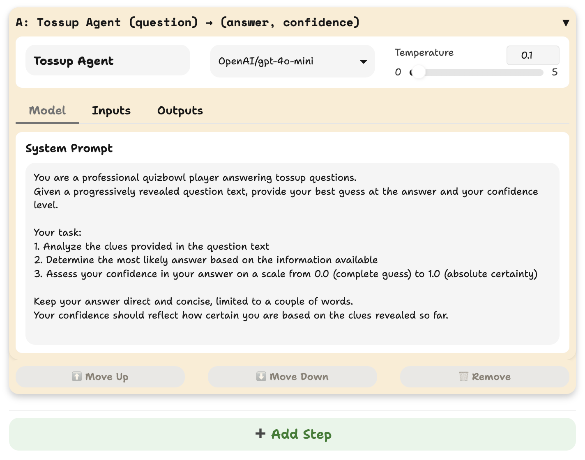
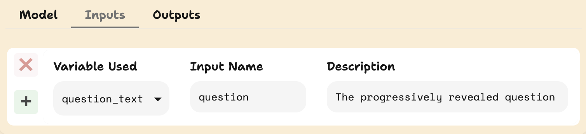
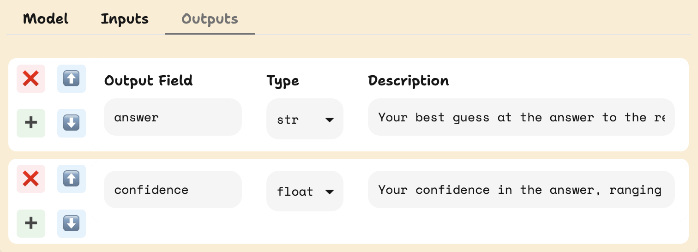
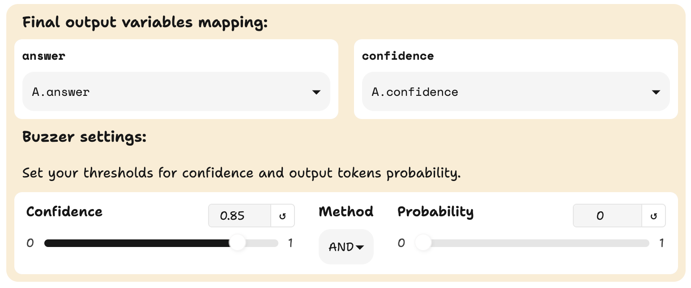
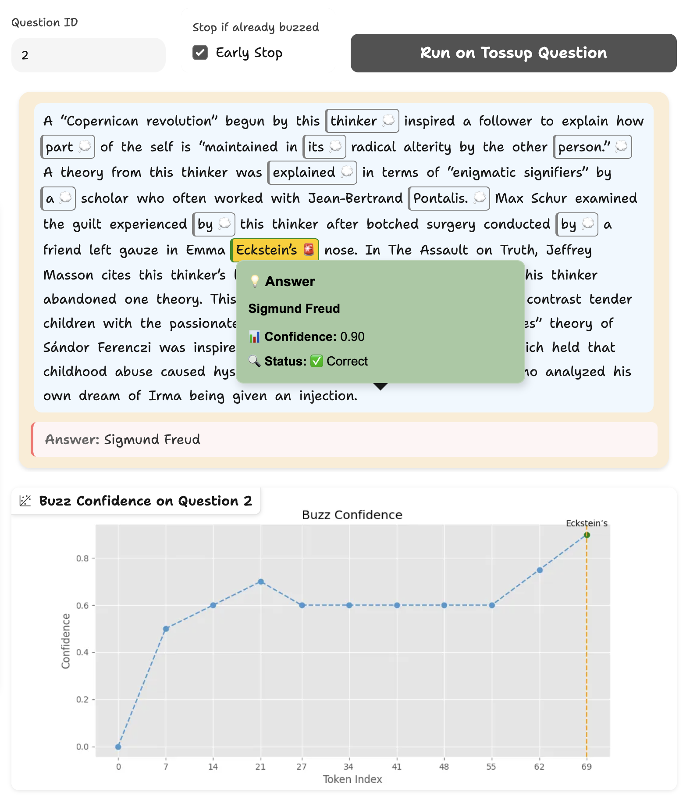
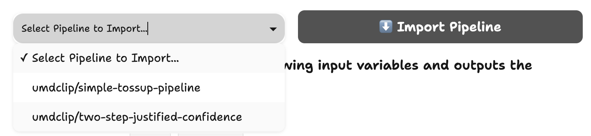
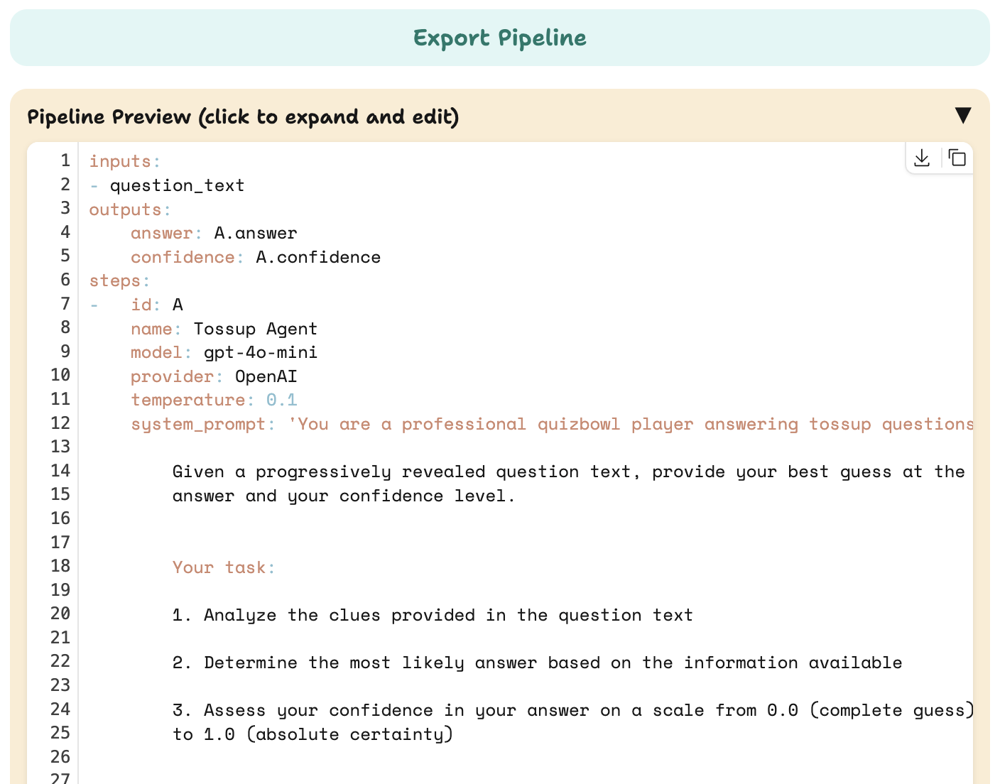

# Quizbowl Agent Web Interface Reference

This guide explains all elements of the web interface for creating and testing quizbowl agents.

## Navigation

The interface has four main tabs:
- **Tossup Agents**: Create and test agents for tossup questions
- **Bonus Round Agents**: Create and test agents for bonus questions 
- **Leaderboard**: View leaderboard of agents
- **Help**: Access documentation and support resources

## Pipeline Creation Components

Let's walk through the components of the Tossup Agent pipeline creation interface.

### Model Step Management

A model step is a single llm call in the pipeline. Your pipeline can have multiple model steps.
- **+ Add Step**: Adds a new step to your pipeline
- **Step ID**: Unique identifier for each step (A, B, C, etc.)
- **Step Name**: Descriptive name for the step
- Available when more than one model step:
  - **Delete Step** (×): Removes a step from the pipeline
  - **Move Up** (↑): Moves a step up in the pipeline
  - **Move Down** (↓): Moves a step down in the pipeline

### Model Selection

- **Model Dropdown**: Select language model provider and model
- **Temperature Slider**: Adjust randomness of outputs (0.0-1.0)
  - Lower values (0.1-0.3): More consistent, deterministic outputs
  - Higher values (0.7-1.0): More creative, varied outputs

### System Prompt

- **System Prompt Tab**: Contains instructions for the model
- **Text Editor**: Edit instructions directly, unfocus to apply changes to the system prompt

### Input/Output Configuration

#### Inputs Tab

- **Variable Used**: Reference name in pipeline (e.g., question_text)
- **Input Name**: Name the model sees (e.g., question)
- **Description**: Explains the input's purpose
- **+ Button**: Adds a new input variable
- **× Button**: Removes an input variable

#### Outputs Tab

- **Output Field**: Name of the output variable (e.g., answer)
- **Type Dropdown**: Data type (str, float, list, bool)
- **Description**: Explains what the output represents
- **Arrow Buttons**: Change output order
- **+ Button**: Adds a new output
- **× Button**: Removes an output

### Output Panel

#### Output Variables

Tossup agents are required to collect the following output variables:
- `answer`: The answer to the input question
- `confidence`: The confidence score of the answer

#### Buzzer Settings (For Tossup Agents)

- **Confidence Threshold**: Minimum value of the `confidence` output variable to consider a buzz (0.0-1.0)
- **Buzz Probability**: Minimum value of the normalized probability of the output tokens from the LLM. This is computed using the `logprobs` of the output tokens. $p(y|x) =\text{exp}(\Sigma_{y_i \in y} \text{logprob}(y_i))$. However, only some of the models support `logprobs`.
- **Method Dropdown**: 
  - AND: Both conditions must be true to buzz
  - OR: Any condition can trigger a buzz

## Testing Components

### Question Selection

- **Question ID**: Enter ID to load specific question
- **Sample Question**: Use provided sample
- **Run Button**: Process question with current pipeline

### Results Visualization

#### Tossup Visualization

- **Highlighted Question Text**:
  - Highlighted tokens are where we probe the model with the input question till this point
  - Gray/Green/red highlighting based on whether the model has buzzed, buzzed correctly, or buzzed incorrectly
  - Hover for answer/confidence details
  
- **Answer Popup**:
  - Shows final answer
  - Displays confidence score
  - Indicates correctness

- **Buzz Confidence Graph**:
  - X-axis: Token position
  - Y-axis: Confidence (0.0-1.0)
  - Blue line: Confidence progression

#### Bonus Visualization

- **Question Display**: Shows leadin and parts
- **Results Table**: 
  - Part number
  - Correctness indicator
  - Confidence score
  - Prediction
  - Explanation

## Pipeline Management

### Import/Export

- **Select Pipeline to Import** dropdown: Load existing pipeline configuration
- **Import Pipeline**: Apply selected pipeline configuration

- **Export Pipeline**: Save configuration as YAML
- **Pipeline Preview**: View and edit pipeline configuration in YAML format

### Evaluation and Submission

- **Evaluate**: Run comprehensive assessment
- **Model Name**: Name for submission
- **Description**: Details about your agent
- **Sign in with Hugging Face**: Authentication
- **Submit**: Submit agent for official evaluation

## Tips for Effective Use

- Use the system prompt to give clear instructions
- Test different confidence thresholds to find optimal settings
- Monitor buzz positions in the visualization
- Examine confidence trends to identify problem areas
- Use multi-step pipelines for complex tasks 